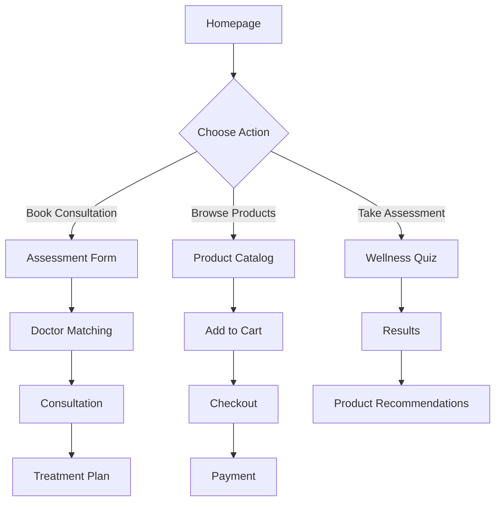

# 🏥 BeBodywise - Healthcare & Wellness Platform

<div align="center">


**A comprehensive healthcare platform providing women's health & wellness solutions**

[]([https://your-vercel-app.vercel.app](https://health-care-oq021shw6-tusharsingh7705-7393s-projects.vercel.app/))
[](LICENSE)
[](https://github.com/yourusername/healthcare-web)

</div>

---

## 🌟 About

BeBodywise is a modern healthcare web application designed to provide women with personalized wellness solutions, doctor consultations, and health products. Our platform combines expert medical knowledge with user-friendly design to make healthcare accessible and convenient.

### 🎯 Mission

> Empowering women to take control of their health and wellness journey with science-based solutions and expert guidance.

---

## ✨ Key Features

### 🏠 **Homepage Experience**
- **Modern UI/UX Design** with responsive layout
- **Interactive Category Navigation** for health concerns
- **Expert Doctor Profiles** with specialization details
- **Customer Reviews & Testimonials** with before/after results
- **Wellness Assessment** integration

### 👩‍⚕️ **Healthcare Services**
- **Free Doctor Consultations** with certified specialists
- **Wellness Assessments** co-created with expert doctors
- **Personalized Treatment Plans** based on individual needs
- **Multiple Health Categories**: Hair, Skin, Nutrition, PCOS, UTI

### 🛒 **E-Commerce Features**
- **Product Catalog** with detailed descriptions
- **Shopping Cart** functionality
- **Secure Payment Options** (COD, Online, UPI)
- **Order Tracking** and delivery information
- **Discount & Cashback** programs

### 📱 **User Experience**
- **Responsive Design** for all devices
- **Intuitive Navigation** with clear CTAs
- **WhatsApp Integration** for quick support
- **Search Functionality** for easy product discovery
- **User Account Management** (Login/Signup)

---

## 🎨 Design System

### 🎨 **Color Palette**
```css
--primary-green: #379F8E;      /* Main CTAs & Brand */
--primary-black: #000000;      /* Text & Headers */
--accent-pink: #EA7477;        /* Highlights */
--accent-blue: #379F8E;        /* Trust Elements */
--light-gray: #F8F9FA;         /* Backgrounds */
--border-light: #E9ECEF;       /* Dividers */
```

### 📐 **Typography**
- **Headings**: Serifa (Serif) - Premium feel
- **Body Text**: Avenir (Sans-serif) - Readability
- **UI Elements**: System fonts - Performance

### 🖼️ **Visual Elements**
- **High-Quality Product Images**
- **Before/After Comparisons**
- **Expert Doctor Photos**
- **Icon-Based Navigation**
- **Smooth Animations & Transitions**

---

## 🚀 Technology Stack

### 🎯 **Frontend**
- **HTML5** - Semantic markup
- **CSS3** - Modern styling with animations
- **JavaScript (ES6+)** - Interactive functionality
- **Swiper.js** - Carousel components

### 🛠️ **Tools & Services**
- **Cloudinary** - Image optimization & CDN
- **Vercel** - Deployment & hosting
- **Git** - Version control
- **Responsive Design** - Mobile-first approach

---

## 📁 Project Structure

```
Health_care_web/
├── 📄 index.html              # Main homepage
├── 🎨 index.css               # Global styles
├── 📂 components/             # Reusable components
│   ├── navbar.js              # Navigation component
│   └── footer.js              # Footer component
├── 📂 styles/                 # Style sheets
│   └── footer.css             # Footer styling
├── 📂 BookdoctorConsultation/  # Doctor booking
├── 📂 Take Wellness/          # Wellness assessment
├── 📂 Choose Concern/         # Health categories
├── 📂 All products/           # Product catalog
├── 📂 Refer Earn/            # Referral program
├── 📂 Login Cart/            # User authentication & cart
├── 📄 .gitignore             # Git ignore rules
├── 📄 vercel.json            # Deployment config
└── 📄 README.md              # This file
```

---

## 🚀 Getting Started

### 📋 **Prerequisites**
- Modern web browser (Chrome, Firefox, Safari, Edge)
- Local web server (optional for development)

### 🛠️ **Installation**

1. **Clone** repository
   ```bash
   git clone https://github.com/Tusharsingh7705/Health_care_web.git
   cd Health_care_web
   ```

2. **Start local server**
   ```bash
   # Using Python
   python -m http.server 8000
   
   # Using Node.js
   npx serve .
   
   # Using PHP
   php -S localhost:8000
   ```

3. **Open in browser**
   ```
   http://localhost:8000
   ```

---

## 🌐 Deployment

### 🚀 **Vercel Deployment**

1. **Install Vercel CLI**
   ```bash
   npm i -g vercel
   ```

2. **Deploy**
   ```bash
   vercel --prod
   ```

3. **Configure Environment**
   - Add custom domain
   - Set up analytics
   - Configure SSL

### 📦 **Manual Deployment**

1. **Build** (if using build tools)
2. **Upload** files to hosting service
3. **Configure** server settings
4. **Set up** SSL certificate

---

## 📱 Features Deep Dive

### 🏥 **Health Categories**

| Category | Focus | Products Available |
|----------|-------|-------------------|
| 💇‍♀️ **Hair Care** | Hair fall, growth, scalp health | Gummies, serums, oils |
| 🧴 **Skin Care** | Acne, aging, clarity | Cleansers, treatments |
| 💊 **Nutrition** | Weight management, supplements | Gummies, vitamins |
| 🩺 **PCOS** | Hormonal balance | Period care, supplements |
| 🌸 **Intimate Care** | UTI prevention | Hygiene products |

### 👩‍⚕️ **Doctor Consultation Flow**

1. **Health Assessment** → Personalized questions
2. **Doctor Matching** → Find relevant specialist
3. **Consultation** → Video/audio call
4. **Treatment Plan** → Personalized recommendations
5. **Product Delivery** → Direct to doorstep

---

## 🎯 User Journey

### 📊 **Typical User Flow**



---

## 🔧 Customization

### 🎨 **Branding**
- Update colors in `index.css`
- Replace logo in navigation
- Customize footer links

### 📱 **Responsive Breakpoints**
```css
/* Mobile */
@media (max-width: 768px) { ... }

/* Tablet */
@media (max-width: 1024px) { ... }

/* Desktop */
@media (min-width: 1025px) { ... }
```

### 🛒 **E-Commerce Integration**
- Update product data in `All products/database/`
- Configure payment gateways
- Set up shipping options

---

## 🤝 Contributing

We welcome contributions! Please follow our guidelines:

1. **Fork** repository
2. **Create** feature branch (`git checkout -b feature/AmazingFeature`)
3. **Commit** changes (`git commit -m 'Add some AmazingFeature'`)
4. **Push** to branch (`git push origin feature/AmazingFeature`)
5. **Open** Pull Request

### 📋 **Development Guidelines**
- Follow responsive design principles
- Maintain code consistency
- Test on multiple devices
- Document changes

---

## 📞 Support & Contact

### 🆘 **Getting Help**
- 📧 **Email**: support@bebodywise.com
- 💬 **WhatsApp**: +91 7710096671
- 🌐 **Website**: [bebodywise.com](https://bebodywise.com)

### 📱 **Social Media**
- 📷 **Instagram**: [@bebodywise](https://instagram.com/bebodywise)
- 📘 **Facebook**: [BeBodywise](https://facebook.com/bebodywise)
- 🐦 **Twitter**: [@bebodywise](https://twitter.com/bebodywise)

---

## 📄 License

This project is licensed under the MIT License - see the [LICENSE](LICENSE) file for details.

---

## 🙏 Acknowledgments

- **Medical Experts** for clinical guidance
- **Design Team** for beautiful UI/UX
- **Development Team** for technical implementation
- **Cloudinary** for image hosting
- **Vercel** for deployment platform

---

<div align="center">

**Made with ❤️ for women's health and wellness**

[⬆️ Back to Top](#-bebodywise---healthcare--wellness-platform)

</div>
